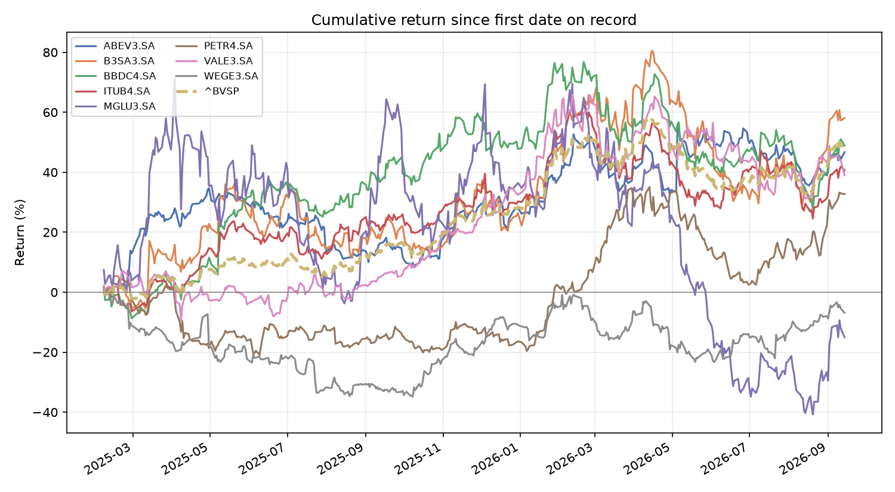
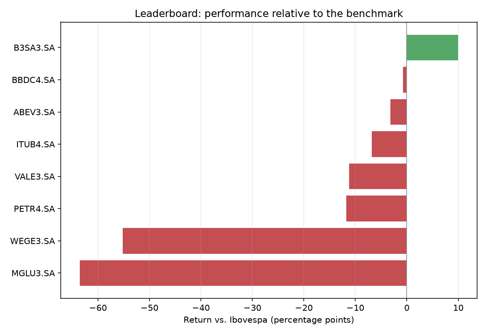
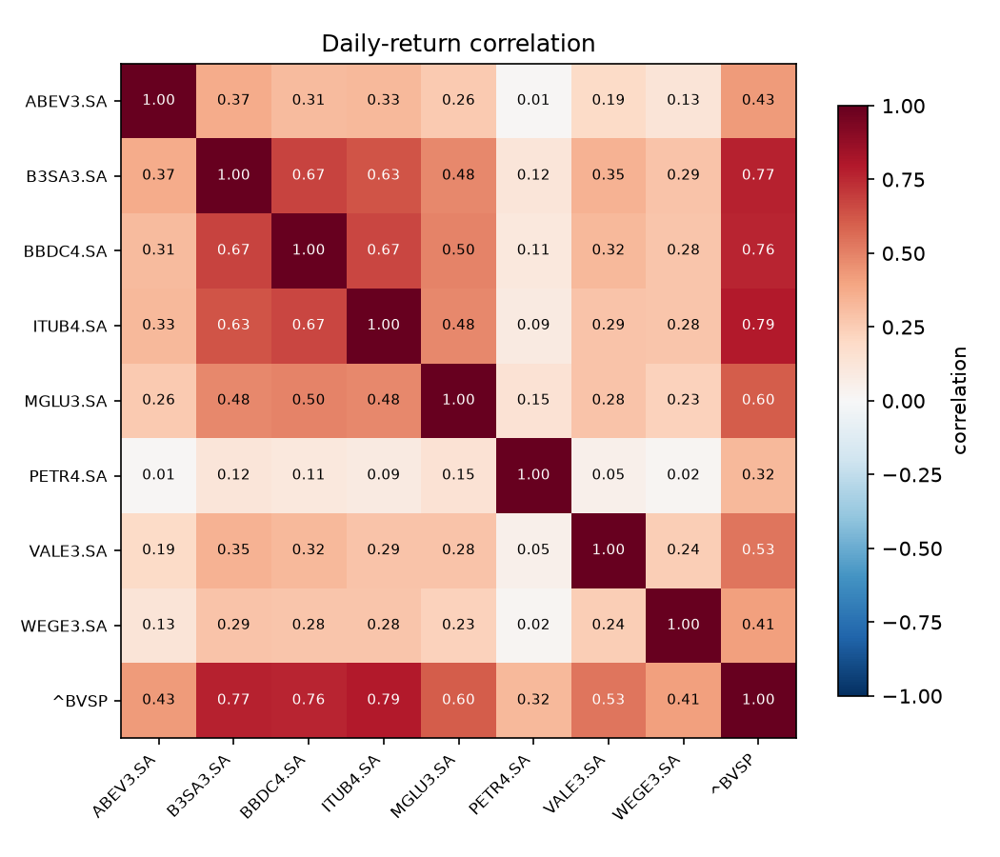

# Daily Brazilian Stock Report — a data pipeline, built to learn

This repo is a **hands-on tour of the classic 6-stage data pipeline**, built
around a real use case: producing a daily report on Brazilian (B3) stocks.

The goal is learning the *framework* first, the app second. Each stage is built
and explained one at a time, with a short note in [`docs/`](docs/) and runnable
code you can execute to *see* the stage work.

## The pipeline

```
1. SOURCES  ->  2. INGESTION  ->  3. STORAGE  ->  4. SERVING (API)  ->  5. ANALYTICS  ->  6. VISUALIZATION
   what data      extract &         Postgres         a real API           signals,          report,
   exists         tidy it           warehouse        (nothing else        rankings          notebook,
                                                      touches the DB)                        charts
                              \___________________ ⟳ MONITOR / OPTIMIZE / GOVERN ___________________/
```

| Stage | Status | Doc |
|-------|--------|-----|
| 1. Data Sources | ✅ built | [docs/01_data_sources.md](docs/01_data_sources.md) |
| 2. Ingestion | ✅ built | [docs/02_ingestion.md](docs/02_ingestion.md) |
| 3. Storage | ✅ built | [docs/03_storage.md](docs/03_storage.md) |
| 4. Serving (API) | ✅ built | [docs/04_api.md](docs/04_api.md) |
| 5. Analytics | ✅ built | [docs/05_analytics.md](docs/05_analytics.md) |
| 6. Visualization & Insights | ✅ built | [docs/06_visualization.md](docs/06_visualization.md) |
| ⟳ Monitor / Govern | ⬜ (woven throughout) | — |

## The analysis, at a glance

These charts are generated straight from the live warehouse by
[`scripts/generate_report_images.py`](scripts/generate_report_images.py), and
refreshed automatically every trading day by the same GitHub Actions
workflow that runs the pipeline (see [docs/06_visualization.md](docs/06_visualization.md)) —
so what you're looking at is never more than a day stale, and you don't need
to run any code yourself to see the analysis.

**Which of these would you rather have owned** — every tracked stock's
cumulative return since its first date on record, rebased to 0%, against the
Ibovespa (dashed):



**Leaderboard** — every tracked stock's latest performance relative to the
Ibovespa benchmark, best to worst:



**Correlation** — how closely each stock's daily moves track every other
stock's:



## Tech choices (all swappable — that's the point of the layered design)

- **Python** — richest ecosystem for financial data
- **Yahoo Finance** (`yfinance`) — free B3 data, no API key
- **Postgres** (hosted free on [Neon](https://neon.tech) or
  [Supabase](https://supabase.com)) — a real, shared, always-on warehouse,
  not a file on one laptop
- **FastAPI** — the serving layer; the one thing allowed to touch the database
- **GitHub Actions** — runs the pipeline on a schedule, on GitHub's own
  servers, so nothing needs to stay running on your machine

## Project layout

```
config/           # settings + ticker universe   (Governance: config-as-code)
stockpipe/        # the pipeline package
  config.py       #   central config loader
  sources/        #   Stage 1: source catalogue
  ingestion/       #   Stage 2: fetch + tidy (yfinance)
  storage/        #   Stage 3: Postgres warehouse (upserts)
  api/            #   Stage 4: FastAPI serving layer
  analytics/      #   Stage 5: returns, moving averages, volatility, vs.-benchmark queries
  run_daily.py    #   thin entrypoint: Stage 2 -> Stage 3, run by the scheduler
scripts/
  generate_report_images.py  # Stage 6: builds docs/assets/*.png embedded above
  build_notebook.py          # regenerates notebooks/explore.ipynb from source
docs/             # one learning note per stage
  assets/         # Stage 6 chart images, embedded in this README
notebooks/        # Stage 6: a notebook client that calls the API and plots it
.github/workflows/
  daily_pipeline.yml   # the actual daily scheduler (cron, GitHub Actions) + chart refresh
  tests.yml            # runs the test suite on every push
data/             # legacy local-cache dirs, unused now that storage is Postgres
tests/
```

## Setup

```bash
pip install -r requirements.txt

# Stage 3 needs a database connection:
cp .env.example .env      # then paste your Neon/Supabase connection string in

python -m stockpipe.sources.registry   # Stage 1
python -m stockpipe.ingestion.yahoo    # Stage 2
python -m stockpipe.storage.db         # Stage 3 (also creates the prices table)
python -m stockpipe.run_daily          # Stage 2 -> 3 together, what the scheduler runs

uvicorn stockpipe.api.main:app --reload   # Stage 4 — then open http://127.0.0.1:8000/docs
                                           #   Stage 5 adds /analytics/* endpoints to the same app

python scripts/generate_report_images.py  # Stage 6 — (re)builds docs/assets/*.png from the warehouse
jupyter notebook notebooks/explore.ipynb  # Stage 6 — the interactive version (needs the API running)

pytest tests/ -v                          # everything except the live-DB tests runs with no setup
```

### Running it on a schedule (production)

`.github/workflows/daily_pipeline.yml` runs `stockpipe.run_daily` and then
`scripts/generate_report_images.py` automatically every weekday shortly after
the B3 close, committing any refreshed charts straight back to the repo. One-time
setup: add your database connection string as a repository secret named
`DATABASE_URL` (**Settings → Secrets and variables → Actions → New repository
secret**) — GitHub's servers have full internet access, so this runs without
your laptop needing to be on.
